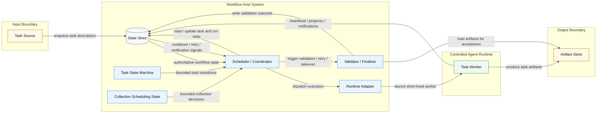

# Abstract Workflow Architecture

> This document describes the abstract workflow architecture behind the current CVE-oriented implementation.
> It focuses on the reusable orchestration model, not the CVE domain itself.

## Overview

The current implementation can be generalized into a workflow system with a controlled agent runtime.

At the abstract level, the workflow has these major parts:

1. `Task Source`
2. `State Store`
3. `Scheduler / Coordinator`
4. `Task Worker`
5. `Validator / Finalizer`
6. `Runtime Adapter`
7. `Artifact Store`

This is not a classic `MapReduce` system. It is closer to a:

- task queue
- lease-based execution model
- short-lived worker runtime
- artifact validation loop
- externally managed state machine

Two design constraints are especially important in this model:

- each `task` must have an explicit state machine, so `mgr` only operates inside a finite control surface
- the workflow must also expose collection-level state, so `mgr` can make bounded scheduling decisions across the task set
- each `worker` must run with an isolated toolset that is adapted to the task type it executes

## Architecture Diagram



## Component Roles

### `Task Source`

`Task Source` is an input boundary, not part of the core execution engine.

Its responsibility is to submit task descriptors into the workflow.

Examples:

- CVE feed
- API ingestion
- database scan
- file-based batch input
- manual task injection

The workflow should treat task source as abstract. It does not need to know where tasks originally came from, only that valid tasks are enqueued into the state store.

To keep this boundary stable, a task should enter the workflow as a task descriptor with at least:

- a stable task identity
- a task type
- enough input context for worker execution
- enough policy context for scheduling and validation

### `State Store`

`State Store` is the system of record for workflow truth.

It holds:

- task state
- run state
- task-set / queue state
- leases
- heartbeats
- notifications
- retries
- cooldowns or rate-limit state

This store is authoritative. Runtime memory, shell sessions, and artifact files are not.

### `Scheduler / Coordinator`

The scheduler is the control-plane component.

It is responsible for:

- selecting queued work
- creating or advancing runs
- observing collection-level scheduling state
- deciding when to dispatch new workers
- deciding when to validate output
- handling retry, takeover, timeout, and cooldown behavior

It should not perform deep task execution itself.

### `Task Worker`

The worker is the execution-plane component.

Its responsibility is to:

- process one task
- use bounded runtime capabilities
- emit progress and heartbeat
- generate artifacts
- exit

It should not own global scheduling logic.

### `Validator / Finalizer`

This component checks whether produced artifacts satisfy completion rules.

It is responsible for:

- reading output artifacts
- applying acceptance rules
- deciding `completed`, `retryable_failed`, or `needs_review`

Validation rules can be domain-specific, but the validation role itself is generic.

### `Runtime Adapter`

The runtime adapter binds the host workflow to a concrete execution runtime.

This layer is where implementation-specific details live, such as:

- `codex exec`
- `CODEX_HOME`
- `tmux`
- environment variables
- prompt templates
- search flags
- MCP configuration
- notification plumbing

This keeps the abstract workflow model separate from the concrete agent/runtime mechanism.

### `Artifact Store`

`Artifact Store` is an output boundary, not the source of orchestration truth.

Its role is to persist execution output in a form that can later be inspected and validated.

Examples:

- evidence bundle
- generated report
- logs
- downloaded sources
- manifests
- notes

Artifacts are the result of work. They are not the workflow state machine itself.

To keep this boundary reusable, artifacts should be treated as an artifact contract rather than a domain-specific directory convention.

That contract usually includes:

- a stable location or key
- a machine-readable manifest
- task output payloads
- logs or evidence
- enough metadata for validation and downstream consumption

## Workflow Boundaries

The architecture has two important boundaries:

### Input Boundary: `Task Source`

Everything before `Task Source` belongs to upstream systems.

The workflow only requires that incoming work can be converted into a stable task descriptor and written into the state store.

This boundary should remain abstract so the same engine can support different upstreams.

What matters at this boundary is not the upstream system itself, but whether it can produce a stable task descriptor contract.

### Output Boundary: `Artifact Store`

Everything after `Artifact Store` belongs to downstream consumers.

Those consumers may be:

- validators
- review tools
- publishing steps
- reporting pipelines
- humans

This boundary should also remain abstract. The workflow engine only needs to ensure artifacts are produced and can be validated or consumed downstream.

What matters at this boundary is not the storage medium itself, but whether it satisfies the artifact contract required by validators and downstream consumers.

## Control Principles

The abstract model follows these rules:

- the state store is the only source of workflow truth
- each task type must define an explicit state machine
- `mgr` is only allowed to perform state-machine-valid control actions
- the workflow must define explicit collection-level state for scheduling decisions
- `mgr` is only allowed to make collection-level decisions on that bounded scheduling state
- scheduler and worker responsibilities are separated
- workers are short-lived and task-scoped
- workers should receive isolated, task-appropriate runtime capabilities only
- artifacts are validation targets, not scheduling truth
- runtime-specific mechanisms are isolated behind the runtime adapter
- input and output boundaries stay abstract

## Interface Contracts

The workflow becomes reusable only if its boundaries are expressed as contracts instead of domain-specific assumptions.

### Task Descriptor Contract

At minimum, a task entering the workflow should carry:

- unique identity
- task type
- input payload or lookup reference
- scheduling metadata
- validation metadata when needed

This is what allows different task sources to feed the same workflow core.

### Artifact Contract

At minimum, artifacts leaving the workflow should provide:

- artifact identity or location
- manifest or summary metadata
- execution logs or evidence
- task result payloads
- enough structure for validators and downstream consumers

This is what allows the workflow to stay agnostic to the final storage format while still supporting reliable validation and downstream use.

## Two Critical Constraints

### 1. `Task` must expose an explicit state machine

The task model cannot be vague. A task needs a well-defined lifecycle with explicit states and allowed transitions.

This is what gives `mgr` a bounded operating space.

Instead of letting the coordinator improvise, the system should constrain it to a finite set of actions such as:

- lease task
- start run
- detect timeout
- trigger validation
- retry task
- escalate to review
- converge terminal state

This matters because:

- `mgr` remains a control-plane component instead of becoming an open-ended decision maker
- takeover and recovery become deterministic
- retries and cooldown behavior can be audited
- a fresh coordinator can resume from stored truth without hidden memory

In other words, the state machine is not just task metadata. It is the boundary that limits what `mgr` is allowed to do.

### 2. The workflow must expose bounded collection-level state

`mgr` does not operate only on individual tasks. It also operates on the task set as a whole.

That means the workflow needs an explicit collection-level model, not just per-task states.

Typical collection-level state includes:

- queue depth
- runnable vs blocked task counts
- active lease count
- available concurrency slots
- retry backlog
- cooldown or quota windows
- notification backlog
- takeover candidates

This matters because many scheduler decisions are not local to a single task. For example:

- whether the system is allowed to launch more workers
- which task class should be admitted next
- whether cooldown pauses only dispatch or also validation
- whether retries should be preferred over fresh tasks
- whether signaled tasks should be prioritized over silent tasks

So `mgr` has two bounded operating surfaces:

- task-level state machine operations
- collection-level scheduling operations

If task state exists without collection state, the coordinator can only reason locally and cannot safely control throughput, fairness, or convergence across the whole workflow.

### 3. `Worker` must get isolated, task-adapted tools

The worker should not receive a generic, unrestricted capability surface.

Instead, it should run with a toolset that is:

- isolated from unrelated workflows
- scoped to the current task type
- constrained by runtime policy
- sufficient for task completion, but no broader than necessary

This tool boundary is usually enforced through the runtime adapter, for example with:

- isolated `CODEX_HOME`
- restricted MCP set
- fixed search path
- fixed prompt templates
- fixed environment variables
- wrapper commands and launch policy

The key idea is that the worker is not merely “a process that executes a task”.
It is “a task-scoped execution environment”.

That distinction matters because the tool boundary determines:

- what evidence the worker can gather
- what actions it can take
- how predictable and auditable its behavior is
- whether the same workflow engine can support different task classes safely

So the abstract architecture depends on two linked constraints:

- `task` defines the legal control surface for `mgr`
- `collection state` defines the legal scheduling surface for `mgr`
- `tooling` defines the legal execution surface for `worker`

## Simplified State Flow

```text
queued -> leased -> running -> awaiting_validation -> completed
running -> retryable_failed -> queued
retryable_failed -> needs_review
```

## Mapping To The Current CVE Implementation

In the current CVE project, the abstract roles map roughly like this:

- `Task Source` -> CVE feeder
- `State Store` -> SQLite
- `Scheduler / Coordinator` -> `mgr`
- `Task Worker` -> single-CVE `worker`
- `Validator / Finalizer` -> `mgr` acceptance logic
- `Runtime Adapter` -> `codex exec` + `CODEX_HOME` + `tmux` + prompt/env wrapper
- `Artifact Store` -> per-CVE evidence directory

## Summary

This workflow should be understood as a general-purpose orchestration pattern with abstract input and output boundaries, explicit state ownership, controlled worker execution, and artifact-based validation.
