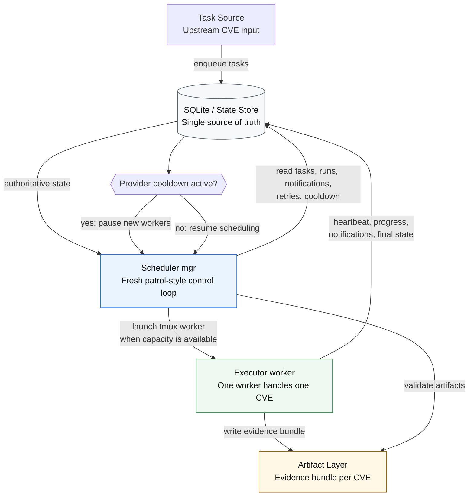

# Current Application Architecture Reference

> This document describes the current implementation as a reference only.
> It is not a target architecture document and should not be treated as a design commitment.

## Overview

The current application can be understood as a five-component workflow:

1. `Task Source`
2. `State Store`
3. `Scheduler (mgr)`
4. `Executor (worker)`
5. `Artifact Layer`

At a high level, this is a SQLite-driven, fresh-`mgr`, patrol-style scheduling system where `tmux` workers execute one CVE at a time and produce evidence bundles that are later validated by `mgr`.

## Architecture Diagram



## Components

### 1. Task Source

The task source is responsible for submitting CVEs into the system.

- Upstream writes pending CVEs into SQLite `tasks`
- Initial task state is `queued`

### 2. State Store

SQLite is the single source of truth for control-plane state.

It records:

- task states
- run lifecycle
- lease state
- heartbeat
- notifications
- retry counters
- queue / collection-level scheduling state
- provider cooldown / quota state

SQLite is authoritative for orchestration decisions. The filesystem is not.

### 3. Scheduler (`mgr`)

`mgr` is a periodic control loop that always starts as a fresh session.

It is responsible for:

- reading task and run state from SQLite
- reading collection-level scheduling state such as queue pressure, active leases, and cooldown
- checking active execution snapshots
- deciding whether a run should be validated, retried, taken over, or newly started
- starting new `tmux` workers when capacity is available
- continuing validation and convergence work during provider cooldown

`mgr` does not perform deep evidence collection. Its job is control and acceptance.

### 4. Executor (`worker`)

A `worker` is a one-shot execution unit. One worker handles exactly one CVE.

It is responsible for:

- collecting evidence
- writing the evidence bundle to disk
- updating heartbeat and progress in SQLite
- writing notifications
- exiting after work is complete

`worker` does not perform global scheduling.

### 5. Artifact Layer

The artifact layer stores the evidence directory for each CVE.

Typical contents include:

- `manifest.json`
- `notes.md`
- `sources/`
- `run.log`

Artifacts are validation inputs. They are not the source of truth for scheduling state.

## Core Control Relationships

The current implementation follows these control rules:

- SQLite is the only authoritative state source
- `mgr` operates on both per-task state and collection-level scheduling state
- `mgr` does not do deep material collection
- `worker` does not do global scheduling
- the filesystem stores artifacts only

## High-Level Control Flow

The closed-loop workflow is:

1. CVEs are inserted into SQLite
2. a fresh `mgr` is triggered on a schedule
3. `mgr` inspects current state
4. if capacity is available, `mgr` launches a `tmux` worker
5. `worker` executes and writes artifacts
6. after the worker exits, a later `mgr` run validates artifacts
7. valid artifacts lead to `completed`
8. invalid or incomplete runs lead to `retryable_failed` or `needs_review`

## Main Data / Task Flow

### Main Path

1. **Task Ingress**
   - upstream writes a CVE into SQLite `tasks`
   - initial state is `queued`

2. **Task Lease**
   - `mgr` selects a task from `queued`
   - `mgr` creates a `run`
   - task enters `leased`

3. **Execution Start**
   - `mgr` launches a `tmux` worker
   - worker begins writing heartbeats
   - state becomes `running`

4. **Artifact Generation**
   - worker writes the evidence directory to the filesystem
   - bundle includes `manifest.json`, `notes.md`, `sources/`, and `run.log`
   - worker continues writing progress back into SQLite

5. **Execution End**
   - worker exits
   - if artifacts are sufficiently complete, the run becomes `awaiting_validation`
   - if execution exits abnormally or no valid artifact bundle exists, the run enters a failure path

6. **Validation**
   - the next fresh `mgr` reads `manifest.json`
   - accepted runs become `completed`
   - rejected runs become `retryable_failed` or `needs_review`

### Collection-Level Scheduling State

Besides individual task and run transitions, the current implementation also depends on collection-level state kept in SQLite.

This includes bounded scheduler inputs such as:

- queue depth
- active lease / run count
- available capacity
- retry backlog
- notification backlog
- cooldown state

This matters because `mgr` is not only advancing a single task state machine. It is also making bounded decisions about the whole task set, such as whether to dispatch more workers, whether to prioritize retries, and whether cooldown should pause dispatch while still allowing validation and convergence.

### Side Path A: Notification Flow

- worker writes notifications into SQLite at meaningful points, such as end-of-turn or final exit
- `mgr` prioritizes runs that emitted notifications
- this reduces the need for heavy inspection of every active `tmux` session on every loop

### Side Path B: Provider Cooldown Flow

- if a provider quota / rate limit is hit, the system writes a global cooldown state into SQLite
- while cooldown is active, `mgr` pauses launching new workers
- validation, failure convergence, notification handling, and state maintenance continue
- normal scheduling resumes after cooldown expires

## Simplified State Machine

Primary success path:

```text
queued -> leased -> running -> awaiting_validation -> completed
```

Failure paths:

```text
running -> retryable_failed -> queued
retryable_failed -> needs_review
```

## Operating Principles

- Task state transitions are governed by SQLite
- Collection-level scheduling decisions are also governed by SQLite
- Artifact files are validation targets, not scheduling truth
- `mgr` advances state
- `worker` generates evidence

## Summary

In one sentence, the current application is a SQLite-driven, fresh-`mgr`, patrol-style scheduler with `tmux` workers and an evidence-bundle validation loop.
