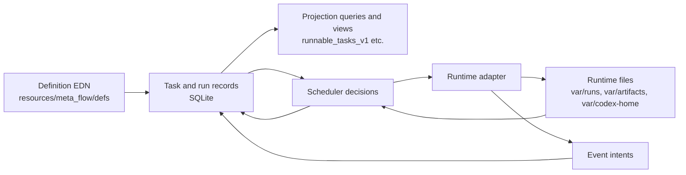
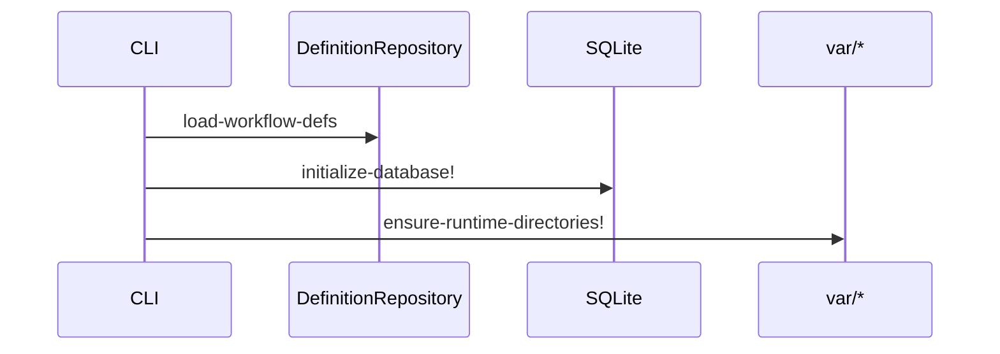
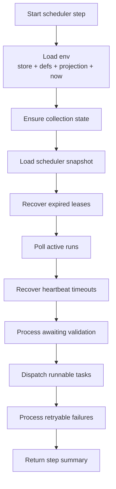
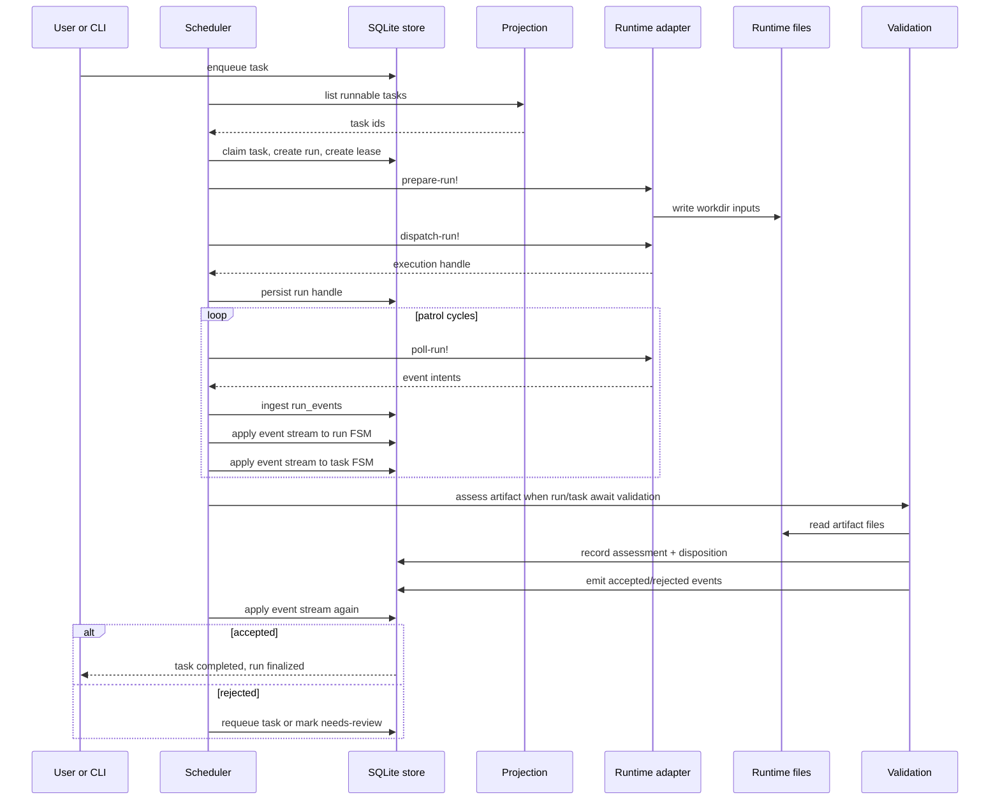
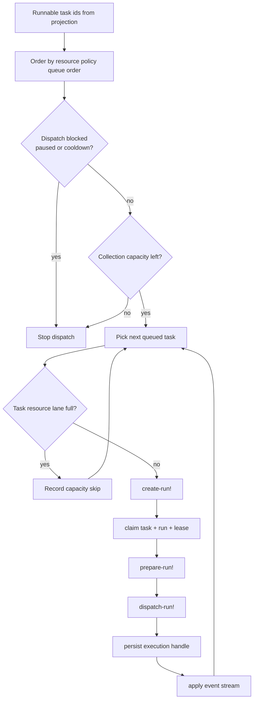
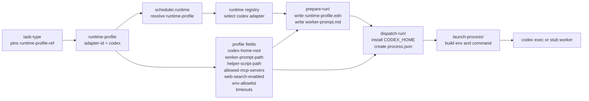
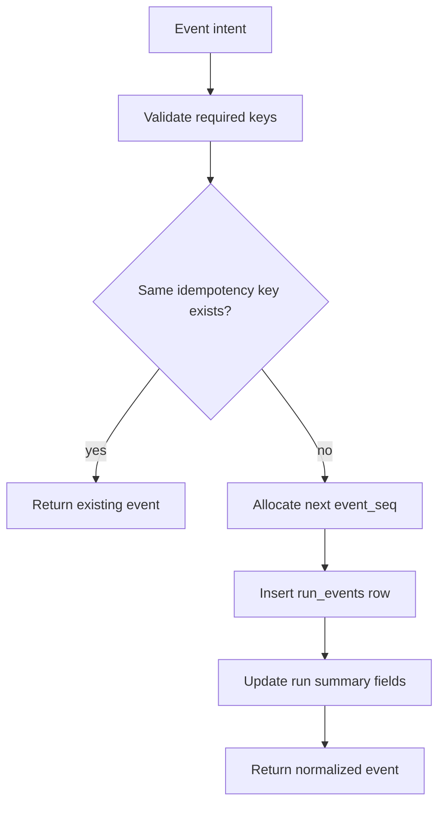
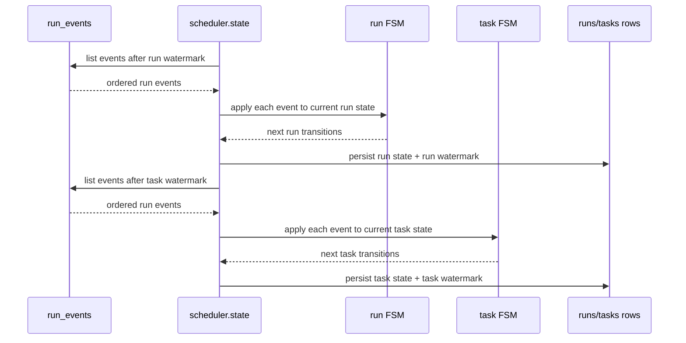
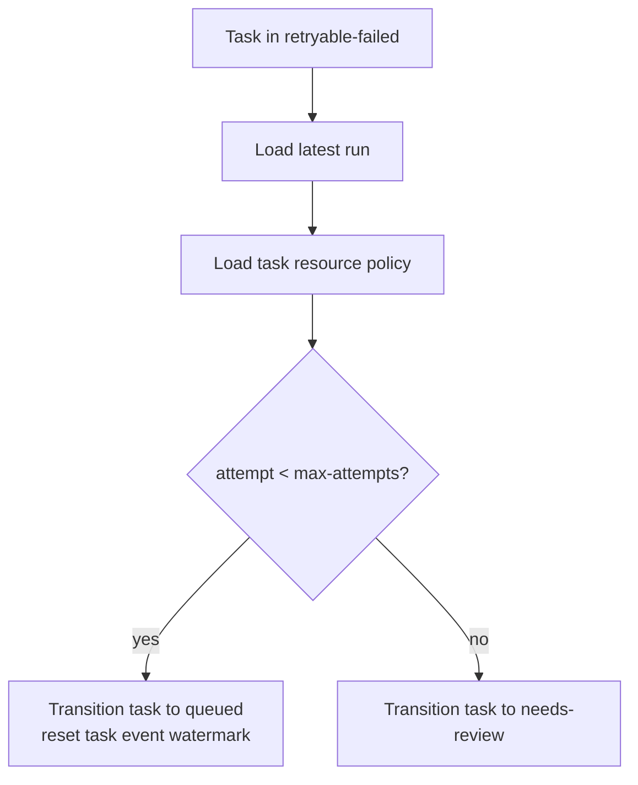
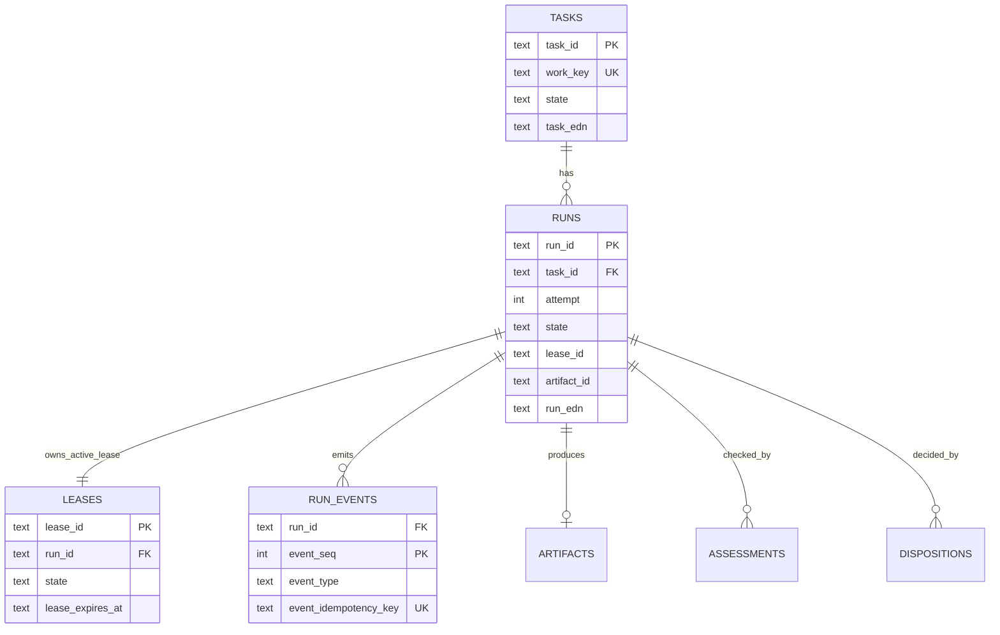

# Meta-Flow Internal Flow

This document explains how the repository currently works internally when a task
is enqueued, dispatched, executed, validated, retried, and inspected.

It is intentionally implementation-facing. The goal is to answer:

- what the control loop does
- where authoritative state lives
- how runtime adapters interact with the control plane
- how events become task/run state transitions

## Mental Model

Meta-Flow is a patrol-style workflow host.

The core split is:

- definitions describe allowed behavior
- SQLite stores authoritative runtime truth
- the scheduler patrols persisted state and pushes it forward
- runtime adapters execute work and emit event intents
- validation converts artifacts into acceptance or rejection decisions

The most important design boundary is:

- runtimes do not directly mutate task/run state
- runtimes emit events
- the scheduler ingests and applies those events through FSMs

## Main Building Blocks

| Area | Role | Main code |
| --- | --- | --- |
| Definitions | Load versioned workflow data from EDN | `src/meta_flow/defs/` |
| Store | Persist tasks, runs, leases, events, artifacts, assessments, dispositions | `src/meta_flow/store/` |
| Projection | Read-only scheduler candidate queries and counts | `src/meta_flow/control/projection.clj` |
| Scheduler | One patrol cycle of recovery, poll, validation, dispatch, retry | `src/meta_flow/scheduler/` |
| Runtime adapters | Prepare, dispatch, poll, cancel one run | `src/meta_flow/runtime/` |
| Validation | Check artifacts against contract and emit decision events | `src/meta_flow/service/validation.clj`, `src/meta_flow/scheduler/validation.clj` |
| CLI | Human-facing operational commands | `src/meta_flow/cli.clj` |

## Four Data Layers

### 1. Definition data

Versioned EDN under `resources/meta_flow/defs/`.

Important definition kinds:

- `workflow.edn`
- `task-types.edn`
- `task-fsms.edn`
- `run-fsms.edn`
- `runtime-profiles.edn`
- `artifact-contracts.edn`
- `validators.edn`
- `resource-policies.edn`

These definitions are loaded through `DefinitionRepository` and then pinned into
task and run records so in-flight meaning does not drift when definitions change.

### 2. Runtime truth

Authoritative state lives in SQLite.

Important persisted entities:

- `tasks`
- `runs`
- `leases`
- `run_events`
- `artifacts`
- `assessments`
- `dispositions`
- `collection_state`

### 3. Projection

Projection is derived read support for scheduler decisions. It is not writable truth.

Current examples:

- `runnable_tasks_v1`
- `awaiting_validation_runs_v1`
- expired lease candidate queries
- heartbeat-timeout candidate queries
- collection snapshot counts

### 4. Runtime-local files

Runtime files live under `var/` and support execution, but they are not the
authoritative control plane.

Examples:

- `var/runs/<run-id>/...`
- `var/artifacts/<task-id>/<run-id>/...`
- `var/codex-home/...`
- Codex `process.json`

## Startup And Bootstrap

At bootstrap time the system:

1. loads workflow definitions
2. initializes the SQLite schema and migrations
3. ensures runtime directories under `var/`

This is what `init` and `defs validate` are exercising.

More precisely:

- `init` covers definitions + database + runtime directories
- `defs validate` only covers the definitions side

## Scheduler Cycle

One scheduler cycle is the heart of the system.

It runs in this order:

This ordering matters:

- recovery happens before new dispatch
- event polling happens before validation
- validation happens before new dispatch decisions are reported
- retry happens after the cycle has seen the current run outcomes

One implementation detail is easy to miss:

- the scheduler snapshot is loaded near the start of the cycle
- some later work re-queries projection directly
- but retry uses the retryable-failed task ids from that earlier snapshot

That means a task that becomes retryable-failed during the current cycle may be
requeued or escalated on the next patrol cycle rather than immediately.

## End-To-End Control Flow

The most useful way to understand the repo is to follow one task.

## How Enqueue Works

`enqueue` writes a task into the control plane.

The store enforces `work_key` uniqueness at both the SQL level and the write path:

- `tasks.work_key` is `UNIQUE`
- `enqueue-task!` first tries to find an existing task by work key
- if a race still happens, it catches the constraint error and loads the existing row

This gives enqueue idempotency for the same logical work item.

One current repository-specific detail:

- the public CLI enqueue path is still demo-shaped
- it currently builds a `:task-type/cve-investigation` task
- by default it swaps the runtime profile to the mock worker for local execution

So today `enqueue` is best understood as the control-plane submission path for
the repository's built-in demo workflow, not yet as a fully generic external API.

## How Dispatch Works

Dispatch reads from projection, not by scanning raw tables ad hoc.

The current dispatch process is:

1. load global active-run count
2. load runnable task ids from projection
3. sort runnable tasks according to the pinned resource policy
4. skip tasks whose resource-policy lane is already full
5. for each admitted task:
   - choose runtime adapter from the pinned runtime profile
   - create a run and lease
   - transition task/run to leased
   - prepare runtime workdir
   - dispatch execution
   - persist execution handle
   - apply any emitted run events

## How Runtime Adapters Fit

The runtime protocol is deliberately narrow:

- `adapter-id`
- `prepare-run!`
- `dispatch-run!`
- `poll-run!`
- `cancel-run!`

The scheduler decides when to call the adapter.
The adapter decides how work is launched and how pollable progress is exposed.

### Task Type To Codex Configuration

This is the specific dependency chain when a task type wants to run on Codex
with a particular configuration.

Read this graph left to right:

- `task-type` chooses which profile to use
- `runtime-profile` carries the Codex-specific configuration
- the scheduler resolves that profile and selects the Codex adapter
- the adapter turns that profile into concrete run inputs, process state, env,
  and launch command

## Design Surfaces

In practice, most product and architecture design work in this repository lands
on two definition types:

- `task-type`
- `runtime-profile`

They are related, but they control different layers.

The most useful shortcut is:

- `task-type` controls task semantics
- `runtime-profile` controls runtime capabilities

### What Task Type Controls

`task-type` is the execution recipe for one class of task.

In the current schema it pins:

- `task-fsm-ref`
- `run-fsm-ref`
- `runtime-profile-ref`
- `artifact-contract-ref`
- `validator-ref`
- `resource-policy-ref`

That means `task-type` is the right place to control these design dimensions:

- task meaning
  Define what this class of task is actually for, such as CVE investigation,
  code review, patch generation, or documentation repair.
- lifecycle behavior
  Choose the task FSM and run FSM that define how the task moves through queue,
  lease, execution, validation, retry, escalation, and terminal states.
- output shape
  Choose the artifact contract that defines what files or artifact structure the
  task must produce.
- acceptance rule
  Choose the validator that determines whether the produced output counts as
  accepted or rejected.
- scheduler policy
  Choose the resource policy that controls concurrency, retry count, lease
  duration, heartbeat timeout, and queue ordering.
- capability package
  Choose which runtime profile this task type is allowed to run with.

Another way to say it:

- `task-type` decides what success means
- `task-type` decides how failure is handled
- `task-type` decides what kind of runtime package the task needs

### What Runtime Profile Controls

`runtime-profile` is the runtime capability bundle used to execute a task.

It does not define what the task means.
It defines how the runtime is allowed to execute it.

For Codex profiles, the current schema supports:

- `adapter-id`
- `dispatch-mode`
- `codex-home-root`
- `allowed-mcp-servers`
- `web-search-enabled?`
- `worker-prompt-path`
- `helper-script-path`
- `artifact-contract-ref`
- `worker-timeout-seconds`
- `heartbeat-interval-seconds`
- `env-allowlist`

That makes `runtime-profile` the right place to control these design dimensions:

- runtime backend
  Choose which adapter implements execution, such as mock or Codex.
- execution shape
  Control whether execution is synchronous, external-process based, or otherwise
  adapter-specific.
- environment boundary
  Control which environment variables are forwarded into the worker process.
- tool boundary
  Control whether web search is enabled and which MCP servers the worker may use.
- prompt and wrapper behavior
  Control which worker prompt template and helper script are used to launch the run.
- local runtime state
  Control which `CODEX_HOME` root the run uses.
- time budget
  Control worker timeout and heartbeat cadence.

Another way to say it:

- `runtime-profile` decides what the worker is allowed to do
- `runtime-profile` decides what context and tools the worker receives
- `runtime-profile` decides how aggressively the runtime is supervised

### Side-By-Side Control Map

| Question | Put it in |
| --- | --- |
| What kind of task is this? | `task-type` |
| What artifact must it produce? | `task-type` via artifact contract |
| How do we validate success? | `task-type` via validator |
| How do we retry or escalate failure? | `task-type` via FSMs and resource policy |
| Which runtime package should execute it? | `task-type` via runtime-profile ref |
| Should the worker have web search? | `runtime-profile` |
| Which MCP servers are allowed? | `runtime-profile` |
| Which env vars may be forwarded? | `runtime-profile` |
| Which prompt should the worker receive? | `runtime-profile` |
| Which `CODEX_HOME` should be used? | `runtime-profile` |
| How long may the worker run? | `runtime-profile` and resource policy |

### Good Default Design Rule

Use this rule when deciding whether to split a task type or split a runtime profile:

- if the task's goal, output contract, validator, or lifecycle meaning changes,
  split `task-type`
- if the task stays the same but the runtime permissions, tools, prompt, env, or
  timeout settings change, split `runtime-profile`

Typical examples:

- same task, different permissions
  Keep one `task-type`, create multiple `runtime-profile` variants.
- different task, different output and acceptance rule
  Create different `task-type` definitions.

This helps keep task semantics separate from execution privilege.

### Mock runtime

The mock adapter is deterministic and local:

- `prepare-run!` writes task/run/profile/contract files into a run workdir
- `dispatch-run!` writes a local runtime-state file and emits `run-dispatched`
- `poll-run!` advances a simple phase machine:
  - dispatched -> started
  - started -> heartbeat
  - heartbeat -> exited + artifact materialized
  - exited -> artifact-ready

This is why the mock adapter is useful for repeatable demos and tests.

### Codex runtime

The Codex adapter has the same scheduler contract, but its runtime side is richer:

- `prepare-run!` creates a durable workdir with task/run/profile/contract inputs
- `dispatch-run!` persists launch metadata and execution state
- `poll-run!` reads the durable `process.json` state and synthesizes missing events
- helper callbacks and the scheduler both contribute to the durable runtime-side state

The key boundary still holds:

- Codex does not directly rewrite control-plane task/run rows
- it emits events or writes runtime-local process state
- the scheduler ingests those events into SQLite

## Event Ingest And State Application

This is the most important internal mechanism.

### Event ingest

Runtime and scheduler producers create `event-intent` maps.
They must include:

- `:event/run-id`
- `:event/type`
- `:event/payload`
- `:event/caused-by`
- `:event/idempotency-key`

The ingest path then:

1. validates the intent
2. rejects producer-supplied `:event/seq`
3. checks whether the same `(run_id, idempotency_key)` already exists
4. assigns the next event sequence
5. inserts the row into `run_events`
6. updates the run summary fields such as `updated-at` and `artifact-id`

### State application

Events are not state transitions by themselves.
They are replay inputs for the pinned FSMs.

For each run or task:

- the store tracks a `last-applied-event-seq` watermark
- the scheduler loads events after that watermark
- each event is applied through the pinned FSM definition
- the entity state changes only if the FSM allows that event from that state
- the watermark is then advanced

This pattern is why the runtime can stay decoupled from the control plane.

## Validation Path

Validation only runs when both of these are true:

- run state is `:run.state/awaiting-validation`
- task state is `:task.state/awaiting-validation`

The validation path:

1. loads the current run and task inside a transaction
2. loads the artifact contract pinned on the task
3. reads artifact files from the artifact root
4. records an assessment
5. records a disposition
6. emits accepted or rejected events
7. reapplies the event stream in the same transaction-scoped store

The current validator is intentionally small: it checks that required artifact
paths exist.

## Retry And Escalation Path

After the cycle has seen retryable-failed tasks, the retry phase decides:

- requeue if `attempt < max-attempts`
- otherwise mark as `needs-review`

This decision is policy-driven through the pinned `resource-policy-ref`.

The task event watermark reset on requeue is important: the next run should be
able to replay its own event stream from zero rather than inheriting the prior
run's watermark.

## Recovery Paths

The scheduler also performs recovery work every patrol cycle.

### Expired lease recovery

If a lease expiry time has passed for a nonterminal run, the scheduler can
recover the run through timeout logic and emit lease-expired consequences.

### Heartbeat timeout recovery

Projection computes candidate runs whose last progress is too old.
The scheduler confirms timeout using the run's pinned heartbeat timeout and then
emits timeout recovery logic.

This is why heartbeats are modeled as events instead of an in-memory timer.

## SQLite Shape And Invariants

The schema stores both structured columns and canonical EDN payloads.

That hybrid shape is intentional:

- structured columns support queries, constraints, and views
- EDN payloads preserve canonical domain shape

Important invariants enforced by schema and write paths:

- `tasks.work_key` is unique
- one nonterminal run per task
- one active lease per run
- one `(run_id, event_idempotency_key)` per run event

## Why Projection Exists Separately

Projection keeps scheduler selection logic simple and bounded.

Instead of making each cycle scan raw state ad hoc, the scheduler asks targeted questions:

- which task ids are runnable now
- which run ids await validation
- which runs have active leases that already expired
- which runs appear heartbeat-stalled
- how many active runs already exist overall and per resource lane

This keeps the patrol loop cheap and explicit.

## Inspection Surface

The current inspect commands are thin read facades over the store:

- inspect task: current pinned definition refs and task state
- inspect run: current run snapshot, artifact root, event count, last heartbeat
- inspect collection: collection-wide dispatch controls

That means inspection is reading control-plane truth, not reconstructing state
from runtime files.

## A Good Way To Read The Code

If you want to trace one run through the codebase, this order works well:

1. `src/meta_flow/cli.clj`
2. `src/meta_flow/scheduler/step.clj`
3. `src/meta_flow/scheduler/dispatch/core.clj`
4. `src/meta_flow/scheduler/runtime.clj`
5. `src/meta_flow/runtime/mock/execution.clj` or `src/meta_flow/runtime/codex/execution.clj`
6. `src/meta_flow/control/event_ingest.clj`
7. `src/meta_flow/scheduler/state.clj`
8. `src/meta_flow/scheduler/validation.clj`
9. `src/meta_flow/scheduler/retry.clj`
10. `src/meta_flow/store/sqlite/`

## Current Practical Reading

If you compress the whole repository down to one sentence, it is this:

Meta-Flow is a SQLite-backed workflow host where the scheduler repeatedly
replays runtime-emitted events through pinned FSM definitions until each task
either completes, retries, times out, or escalates for review.
